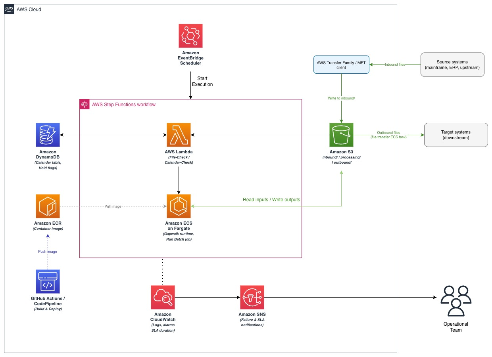
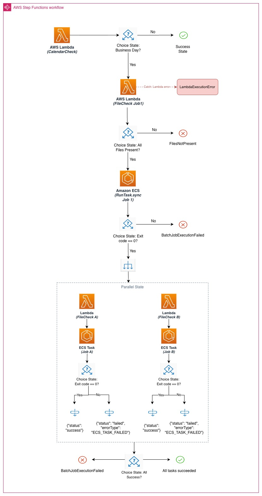

# Replacing Mainframe Batch Schedulers with AWS Step Functions and ECS Fargate — IaC Reference Implementation

> Serverless, infrastructure-as-code batch orchestration — Step Functions, Lambda, ECS Fargate, EventBridge Scheduler, and S3.

This repository is a **runnable reference** for replacing a mainframe batch
scheduler (such as BMC Control-M or CA7) with a serverless orchestration layer on
AWS. The **orchestration and infrastructure** (Step Functions, Lambda,
CloudFormation, EventBridge, CI/CD) is fully functional and deploys end-to-end. The **batch
programs** are domain-neutral stand-ins — this reference deliberately does not
modernize program logic (that is handled separately by AWS Transform).

## Contents

- [Architecture](#architecture)
- [The sample chain](#the-sample-chain)
- [What's in here](#whats-in-here)
- [Faithful skeleton vs runnable stub (the container)](#faithful-skeleton-vs-runnable-stub-the-container)
- [Prerequisites](#prerequisites)
- [Deploy (sandbox account)](#deploy-sandbox-account)
- [Run a test execution](#run-a-test-execution)
- [Teardown](#teardown)
- [Notes / caveats](#notes--caveats)
- [Security](#security)
- [Disclaimer](#disclaimer)

## Architecture

This reference replaces the mainframe scheduler and its inter-job data plane with
managed AWS services. EventBridge Scheduler triggers a Step Functions state
machine; Lambda validates pre-conditions (business-day and file-arrival gates);
ECS on Fargate runs each batch job from a single image selected by command
override; S3 is the inter-job data layer; and CloudWatch and SNS handle
observability and alerting.



Inside the state machine, every job follows the same shape — a Lambda file-check,
a Choice on the result, an ECS `RunTask.sync`, and a Choice on the container exit
code — chained as `JOB1 → [JOB2A ‖ JOB2B] → JOB3`. Each parallel branch catches
its own failures so one branch failing does not abort the other.



## The sample chain

A generic split → parallel → merge chain that mirrors the *shape* of a real
mainframe batch stream without any domain specifics:

```
CalendarCheck ─▶ JOB1 ─▶ [ JOB2A ‖ JOB2B ] ─▶ JOB3 ─▶ (outbound)
 business-day    normalize   fees   rebates    merge
```

Data flows through S3, and each job's output is the next job's implicit
IN-condition — mirroring a mainframe scheduler's file-based dependencies:

```
inbound/transactions/txns.YYYYMMDD.csv
   └▶ processing/JOB1/output/normalized.csv
        ├▶ processing/JOB2A/output/fees.csv     ┐
        └▶ processing/JOB2B/output/rebates.csv  ┴▶ outbound/summary.csv
```

## What's in here

| Component | Files |
|---|---|
| **Foundation** — S3 data layer, VPC, IAM, SNS | `iac/00-foundation.yaml`, `iac/10-iam.yaml` |
| **Batch execution** — container image + ECS task definition | `container/` (faithful) + `container/runnable-stub/` (runnable); `iac/20-ecs.yaml` |
| **Pre-condition checks** — file-check Lambda | `lambda/file_check/` |
| **Business-day gate** | `lambda/calendar_check/` |
| **Orchestration** — Step Functions state machine (init, three-state group, parallel) | `statemachine/batch-orchestrator.asl.json` |
| **Time-based trigger** — EventBridge Scheduler | `iac/40-statemachine.yaml` (`AWS::Scheduler::Schedule`) |
| **CI/CD** — build, deploy, regression gate | `cicd/build-and-deploy.yml` |
| **Regression testing** (testRunPrefix, Map) | `statemachine/regression-test.asl.json`; regression gate in `cicd/build-and-deploy.yml` |
| **Monitoring + alerting** | `iac/50-observability.yaml` |

The state machine (`statemachine/batch-orchestrator.asl.json`) and the file-check
Lambda (`lambda/file_check/lambda_function.py`) are the core of the sample.

## Faithful skeleton vs runnable stub (the container)

Grounded in a real production implementation and current AWS tooling: a transformed
batch job is **two AWS Transform artifacts** running on the licensed **AWS Transform
for mainframe refactor runtime** (Tomcat + JICS):

- **JCL → Groovy** (`container/jobs/JOB1.jcl.groovy`) — job control, S3 I/O, COND
  gating. The ECS `Command` override selects this by name.
- **COBOL → Java** (`container/programs/Job1.java`) — business logic, invoked by
  the Groovy via `runProgram`.

That runtime is proprietary and not publicly runnable, so `container/runnable-stub/`
is a small Java test double honoring the **identical contract** (command override →
program name, S3 in/out, exit code). It proves the orchestration; swap it for your
transformed image in production. See [`container/README.md`](container/README.md).

## Prerequisites

- An AWS account you can create VPC / ECS / Step Functions / Lambda resources in
  (a **sandbox**, not production — see the disclaimer below).
- AWS CLI v2 configured with credentials for that account.
- Docker (to build the container image) and a JDK 17 + Maven if building locally.
- Region with the AWS Transform for mainframe refactor runtime available if you
  later swap in a real transformed image (the sample itself is region-agnostic; default
  `<REGION_ID>`).
- S3 bucket names are globally unique — the templates suffix with the account ID.

## Deploy (sandbox account)

The CI workflow (`cicd/build-and-deploy.yml`) automates all of this; to do it by
hand, follow the same order:

```bash
ENV=dev; REGION=<REGION_ID>          # replace with your target region before running
ACCOUNT=$(aws sts get-caller-identity --query Account --output text)

# 1. foundation + IAM
PLID=$(aws ec2 describe-managed-prefix-lists \
  --filters Name=prefix-list-name,Values=com.amazonaws.$REGION.s3 \
  --query 'PrefixLists[0].PrefixListId' --output text)
aws cloudformation deploy --stack-name batch-$ENV-foundation \
  --template-file iac/00-foundation.yaml \
  --parameter-overrides EnvName=$ENV S3PrefixListId=$PLID
aws cloudformation deploy --stack-name batch-$ENV-iam \
  --template-file iac/10-iam.yaml --parameter-overrides EnvName=$ENV --capabilities CAPABILITY_IAM

# 2. build + push the runnable stub image
REPO=$ACCOUNT.dkr.ecr.$REGION.amazonaws.com/batch-stub
aws ecr create-repository --repository-name batch-stub 2>/dev/null || true
aws ecr get-login-password | docker login --username AWS --password-stdin $ACCOUNT.dkr.ecr.$REGION.amazonaws.com
docker build -t $REPO:latest container/runnable-stub && docker push $REPO:latest

# 3. package Lambda + ASL to an artifact bucket
BUCKET=batch-artifacts-$ENV-$ACCOUNT
aws s3 mb s3://$BUCKET 2>/dev/null || true
(cd lambda/file_check && zip -qr /tmp/fc.zip lambda_function.py) && aws s3 cp /tmp/fc.zip s3://$BUCKET/lambda/file_check.zip
(cd lambda/calendar_check && zip -qr /tmp/cc.zip lambda_function.py) && aws s3 cp /tmp/cc.zip s3://$BUCKET/lambda/calendar_check.zip
aws s3 cp statemachine/ s3://$BUCKET/statemachine/ --recursive

# 4. app stacks
aws cloudformation deploy --stack-name batch-$ENV-ecs --template-file iac/20-ecs.yaml \
  --parameter-overrides EnvName=$ENV ContainerImage=$REPO:latest
aws cloudformation deploy --stack-name batch-$ENV-lambda --template-file iac/30-lambda.yaml \
  --parameter-overrides EnvName=$ENV LambdaCodeBucket=$BUCKET --capabilities CAPABILITY_IAM
aws cloudformation deploy --stack-name batch-$ENV-statemachine --template-file iac/40-statemachine.yaml \
  --parameter-overrides EnvName=$ENV DefinitionBucket=$BUCKET
aws cloudformation deploy --stack-name batch-$ENV-observability --template-file iac/50-observability.yaml \
  --parameter-overrides EnvName=$ENV OpsEmail=you@example.com
```

## Run a test execution

```bash
BUCKET=batch-data-$ENV-$ACCOUNT
# seed inputs under an isolated test prefix
aws s3 cp sample-data/inbound/ s3://$BUCKET/test-runs/demo/inbound/ --recursive
SM=$(aws cloudformation list-exports --query "Exports[?Name=='batch-$ENV-statemachine-arn'].Value" --output text)
aws stepfunctions start-execution --state-machine-arn $SM --input '{"testRunPrefix":"test-runs/demo/"}'
```

Watch it in the Step Functions console (the visual graph is the Control-M
job-flow replacement). A production run is triggered by EventBridge with `{}` —
`SetDefaults` resolves `testRunPrefix` to empty.

## Teardown

```bash
for s in observability statemachine lambda ecs iam foundation; do
  aws cloudformation delete-stack --stack-name batch-$ENV-$s
done
# empty + delete the data and artifact buckets, and the ECR repo, separately.
```

## Notes / caveats

- **Container index.** This sample has a single container, so the exit-code Choice
  reads `Containers[0].ExitCode`. The real AWS Transform for mainframe refactor
  runtime image has a sidecar — there the app container is `Containers[1]`. Confirm
  against your task definition.
- **CPU architecture.** `iac/20-ecs.yaml` sets `CpuArchitecture` (default `X86_64`,
  matching GitHub-runner builds). If you build the image on Apple Silicon, either
  pass `CpuArchitecture=ARM64` or build with `docker buildx --platform linux/amd64`,
  or the Fargate task will fail with an image-manifest arch error.
- **Costs.** Deploying creates a VPC, interface endpoints (hourly charge), ECS
  tasks, and Lambda. Tear down when done.

## Security

What the sample already does:

- **S3**: default encryption (SSE-S3 + bucket keys), all public access blocked,
  versioning on, and a bucket policy that **denies non-TLS** access.
- **Networking**: tasks run in private subnets with **no NAT/internet path**;
  egress is scoped to the ECR/Logs interface endpoints and the S3 managed prefix
  list (no `0.0.0.0/0`). S3 reaches the bucket over a gateway endpoint.
- **IAM**: one least-privilege role per service, using inline policies scoped to
  specific ARNs (no AWS-managed policies). Task S3 access is scoped to the one
  bucket; the ECS execution role's image pull is scoped to the `batch-stub` ECR
  repo and log writes to the ECS log group; the Lambda role's log writes are
  scoped to the `batch-*` Lambda log groups; `ecs:RunTask`/`StopTask`/`DescribeTasks`
  are scoped to this environment's task-definition and task ARNs; Step Functions
  `lambda:InvokeFunction` is scoped to `batch-*` functions in this account.
- **Containers**: the runnable-stub image runs as a **non-root** user and declares
  a `HEALTHCHECK`.
- **Observability**: ECS **Container Insights** is enabled for per-task
  CPU/memory/network metrics.
- **SNS**: encrypted at rest with the AWS-managed key.
- **CI/CD**: GitHub Actions authenticates via **OIDC** — no long-lived AWS keys,
  and actions are pinned to full commit SHAs.
- **No secrets in source.** Ops email, ARNs, and the S3 prefix-list ID are
  parameters, not hardcoded.

What you must add for production (intentionally out of scope here): customer-managed
KMS keys, S3 access logging, VPC flow logs, Step Functions execution logging and
X-Ray tracing, CloudTrail, `cfn-nag`/Checkov in CI, Lambda DLQs and reserved
concurrency, and a `PermissionsBoundary` on the roles.

## Disclaimer

This is sample code to illustrate an architectural approach. It is **not** production-ready and
carries no warranty. Review it against your own security, compliance, and cost
controls before any real use. Deploy only into a non-production account.
